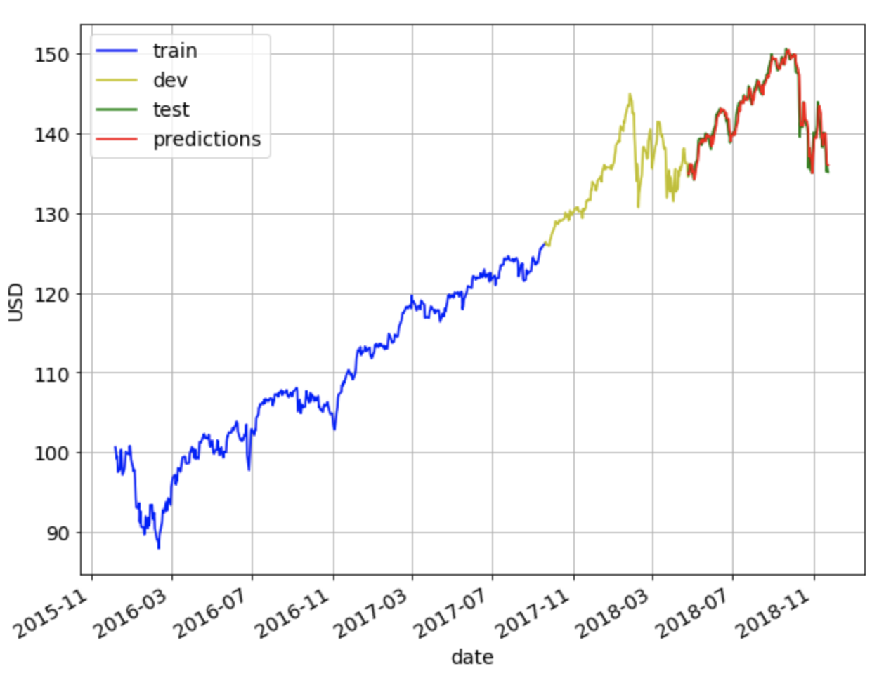

# Stock Price Prediction
Programs for stock price prediction. The results have been compiled into a blog post [here](https://towardsdatascience.com/machine-learning-techniques-applied-to-stock-price-prediction-6c1994da8001). 

* **StockPricePrediction_v1_xgboost.ipynb**:
	* Predict stock price in next day using XGBoost
    * Given prices and other features for the last N days, we do prediction for day N+1
	* Here we split 3 years of data into train(60%), dev(20%) and test(20%)
	* Doesn't work well, likely because data is not normalized
* **StockPricePrediction_v1a_xgboost.ipynb**:
    * Predict stock price in next day using XGBoost
    * Given prices and other features for the last N days, we do prediction for day N+1
    * Here we split 3 years of data into train(60%), dev(20%) and test(20%)
    * Here we scale the train set to have mean 0 and variance 1, and apply the same transformation to dev and test sets
    * Doesn't work well, likely because the model was trained on prices below ~1.7 and so when it saw prices above 1.7 for the dev set, it could not generalize well
* **StockPricePrediction_v1b_xgboost.ipynb**:
    * Predict stock price in next day using XGBoost
    * Given prices and other features for the last N days, we do prediction for day N+1
    * Here we split 3 years of data into train(60%), dev(20%) and test(20%)
    * Here for the past N values for the dev set, we scale them to have mean 0 and variance 1, and do prediction on them
    * Doesn't work well, likely because the model was trained on prices below ~1.7 and so when it saw prices above 1.7 for the dev set, it could not generalize well
* **StockPricePrediction_v1c_xgboost.ipynb**:
    * Predict stock price in next day using XGBoost
    * Given prices and other features for the last N days, we do prediction for day N+1
    * Here we split 3 years of data into train(60%), dev(20%) and test(20%)
    * Whenever we do prediction on dev or test set we scale the previous N values to also have mean 0 and var 1
    * Works well. On the test set, the **RMSE is 1.162 and MAPE is 0.58%** after hyperparamter tuning and using N_opt=3
* **StockPricePrediction_v2_lin_reg.ipynb**:
	* Predict stock price in next day using linear regression
	* Given prices for the last N days, we train a model, and predict for day N+1
    * Works well. On the test set, the **RMSE is 1.42 and MAPE is 0.707%** using N_opt=5
* **StockPricePrediction_v3_mov_avg.ipynb**:
    * Predict stock price in next day using simple moving average
    * Given prices for the last N days, we do prediction for day N+1
    * Works well. On the test set, the **RMSE is 1.27 and MAPE is 0.64%** using N_opt=2
* **StockPricePrediction_v4_lstm.ipynb**:
	* Predict stock price in next day using long short term memory(LSTM)
	* Given prices for the last N days, we do prediction for day N+1
	* Here we split 3 years of data into train(60%), dev(20%) and test(20%)
	* Here we use MinMaxScalar to fit_transform the train set, which we then use to transform the test set
	* Works well. On the test set, the **RMSE is 2.988 and MAPE is 1.886%** using N_opt=5
* **StockPricePrediction_v4a_lstm.ipynb**:
	* Predict stock price in next day using long short term memory(LSTM)
	* Given prices for the last N days, we do prediction for day N+1
	* Here we split 3 years of data into train(60%), dev(20%) and test(20%)
	* Instead of MinMaxScaler, here we use StandardScaler
	* Whenever we do prediction on dev or test set we scale the previous N values to also have mean 0 and var 1
	* Works well. On the test set, the **RMSE is 1.164 and MAPE is 0.583%** using N_opt=3
* **StockPricePrediction_v5_last_value.ipynb**:
	* Predict stock price in next day using last value method ie. use price on day t-1 to predict price on day t
	* Works well. On the test set, the RMSE is 1.127 and MAPE is 0.565% using last value prediction

