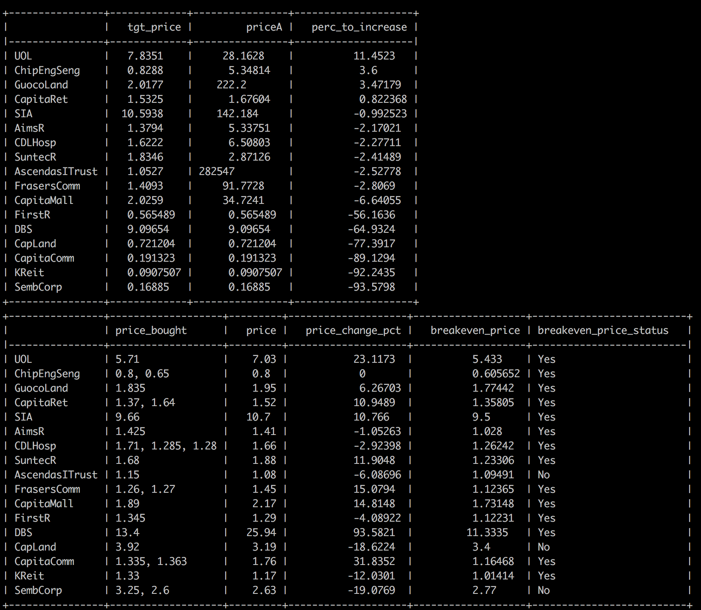

# evalPortfolio

Evaluates your stock portfolio. 

The programs scrape yahoo finance website, computes and returns the following *for each stock*:
* Target price of stock
* Percentage to increase from current price to target price
* Breakeven price
* Whether the stock broke-even
* Market value of stock
* Weightage of stock in portfolio
* Dividends collected from stock
* Profit from stock
* Dividend yield of stock
* Dividend per year from stock
* Dividend pay dates of each stock
* Length of period bought for stock
* Compound annual growth rate (CAGR) of stock 
* CAGR of benchmark
* Whether the stock beat the benchmark

For the entire portfolio, the program computes and returns the following:
* Total portfolio market value (marked to market)
* Total profit (marked to market)
* Dividend per month from entire portfolio
* Weighted CAGR of entire portfolio
* Weighted CAGR of benchmark
* Sharpe Ratio

